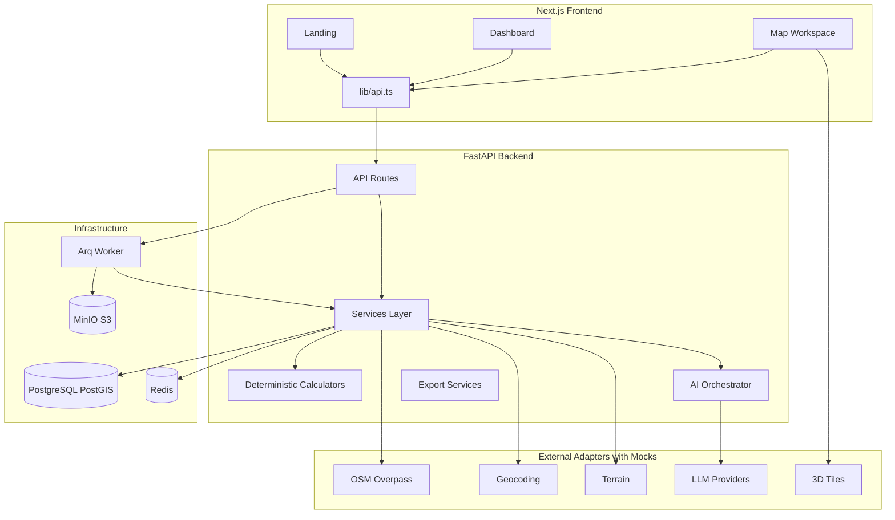

# GeoAI 3D Construction Planner — Build Plan

## Starting Point

Workspace [`D:\layout project`](D:\layout project) is **empty**. We build from scratch using your confirmed choices:

- **Monorepo** at repo root
- **Auth placeholder** (single mock user; `user_id` on projects for future real auth)
- **Arq** for async jobs (design generation, exports, site analysis)

## Repository Layout

```
geoai-construction-planner/
├── docker-compose.yml          # PostGIS, Redis, MinIO (S3-compatible)
├── .env.example
├── README.md
├── frontend/                     # Next.js 14+ App Router, TypeScript, Tailwind
│   ├── app/
│   │   ├── page.tsx              # Landing
│   │   ├── dashboard/page.tsx
│   │   ├── projects/new/page.tsx
│   │   └── projects/[id]/workspace/page.tsx  # Cesium placeholder
│   ├── components/
│   ├── lib/api.ts                # FastAPI client
│   └── stores/projectStore.ts    # Zustand
└── backend/                      # FastAPI + SQLAlchemy + Alembic + Arq
    ├── app/
    │   ├── main.py
    │   ├── api/routes/projects.py
    │   ├── core/config.py
    │   ├── db/models.py, session.py
    │   ├── services/             # stubs per phase
    │   └── workers/tasks.py      # Arq task definitions
    ├── alembic/
    └── requirements.txt
```

## Architecture



**Key principle:** LLM orchestrates and explains; all quantities/costs come from deterministic Python functions in `backend/app/services/calculations/`.

---

## Phase 1: Foundation (First Coding Task)

### 1.1 Docker & Environment

[`docker-compose.yml`](docker-compose.yml):
- `postgis/postgis:16-3.4` on port 5432
- `redis:7-alpine` on port 6379
- `minio/minio` on ports 9000/9001 (local S3 for GLB/PDF exports)

[`.env.example`](.env.example) — all vars from your spec, with sensible local defaults (`DATABASE_URL`, `REDIS_URL`, `S3_*`, API keys blank).

### 1.2 Backend (FastAPI)

| File | Purpose |
|------|---------|
| [`backend/app/main.py`](backend/app/main.py) | FastAPI app, CORS for `localhost:3000`, health check |
| [`backend/app/core/config.py`](backend/app/core/config.py) | Pydantic Settings from env |
| [`backend/app/db/models.py`](backend/app/db/models.py) | SQLAlchemy models: `User`, `Project`, `SiteAnalysis`, `DesignScenario`, `QuantityEstimate`, `GeneratedFile`, `RateItem` |
| [`backend/app/db/session.py`](backend/app/db/session.py) | Engine + `get_db` dependency |
| [`backend/alembic/`](backend/alembic/) | Initial migration enabling PostGIS extension + all tables |
| [`backend/app/api/routes/projects.py`](backend/app/api/routes/projects.py) | CRUD: `POST/GET/PUT/DELETE /api/projects`, boundary as GeoJSON → `ST_GeomFromGeoJSON` |
| [`backend/app/core/security.py`](backend/app/core/security.py) | Mock auth: `X-Mock-User-Id` header or fixed dev user |
| [`backend/app/core/disclaimer.py`](backend/app/core/disclaimer.py) | Shared disclaimer string injected into API responses |

**Project API shape (MVP):**
```json
{
  "name": "NH-48 Flyover Concept",
  "project_type": "flyover",
  "units": "metric",
  "location_name": "...",
  "center_lat": 12.97,
  "center_lng": 77.59,
  "boundary_geojson": { "type": "Polygon", "coordinates": [...] }
}
```

Every response includes:
```json
{ "disclaimer": "Preliminary planning output only. Not for construction approval." }
```

### 1.3 Frontend (Next.js)

Bootstrap with `create-next-app` (App Router, TypeScript, Tailwind, ESLint).

| Route | File | MVP content |
|-------|------|-------------|
| `/` | [`frontend/app/page.tsx`](frontend/app/page.tsx) | Hero, disclaimer banner, CTA "Start New Project" |
| `/dashboard` | [`frontend/app/dashboard/page.tsx`](frontend/app/dashboard/page.tsx) | Project list from API |
| `/projects/new` | [`frontend/app/projects/new/page.tsx`](frontend/app/projects/new/page.tsx) | Name, type select, lat/lng inputs (map in Phase 2) |
| `/projects/[id]/workspace` | [`frontend/app/projects/[id]/workspace/page.tsx`](frontend/app/projects/[id]/workspace/page.tsx) | 3-panel layout + Cesium placeholder div + disclaimer |

Shared UI:
- [`frontend/components/DisclaimerBanner.tsx`](frontend/components/DisclaimerBanner.tsx) — persistent warning
- [`frontend/components/layout/AppShell.tsx`](frontend/components/layout/AppShell.tsx) — nav, dark/light toggle (next-themes)
- [`frontend/lib/api.ts`](frontend/lib/api.ts) — typed fetch wrapper to `http://localhost:8000`

### 1.4 Phase 1 Acceptance

```bash
cp .env.example .env
docker compose up -d
cd backend && pip install -r requirements.txt && alembic upgrade head && uvicorn app.main:app --reload
cd frontend && npm install && npm run dev
```

- Create project via UI → stored in PostGIS
- Dashboard lists projects
- Workspace page loads with project ID
- Disclaimer visible on all pages

---

## Phase 2: Map Workspace

- Install **CesiumJS** (`resium` or dynamic import) in workspace page
- Add **MapLibre GL** as 2D panel/tab fallback
- Geocoding adapter: [`backend/app/services/geospatial/geocoding.py`](backend/app/services/geospatial/geocoding.py) with `NominatimProvider` + `MockGeocodingProvider`
- Map toolbar (draw polygon/line, measure, clear) via MapLibre Draw or Terra Draw
- Save `boundary_geom` and optional alignment line to project via `PUT /api/projects/{id}`
- Layer toggle UI (wired in Phase 3+)

**Fallback:** If `CESIUM_ION_TOKEN` missing, show 2D map + message; Cesium loads with default ellipsoid terrain only.

---

## Phase 3: Site Analysis

- [`backend/app/services/geospatial/osm_overpass.py`](backend/app/services/geospatial/osm_overpass.py) — Overpass query for roads/buildings in bbox; `MockOSMProvider` returns sample GeoJSON
- [`backend/app/services/geospatial/spatial_analysis.py`](backend/app/services/geospatial/spatial_analysis.py) — area (geodesic via `pyproj`/`shapely`), perimeter, slope placeholder
- `POST /api/projects/{id}/site-analysis` — sync for MVP; Arq task in Phase 4
- Route: `/projects/[id]/analysis` — GeoJSON layers on map, risk badges for missing data
- Redis cache keyed by `project_id + bbox hash` (TTL 24h)

---

## Phase 4: Design Generator MVP

**Forms** (React Hook Form + Zod) per type in left panel:
- Flyover, Building, Pipeline, Road

**AI layer** ([`backend/app/services/ai/`](backend/app/services/ai/)):
- `orchestrator.py` — pipeline: validate inputs → call LLM → Pydantic validate output → calculators → persist
- `schemas.py` — matches your JSON schema exactly
- `safety_guardrails.py` — reject outputs missing `assumptions`, `risks`, `required_engineer_review`
- `prompts.py` — system prompt from your spec
- Provider abstraction: `OpenAIProvider`, `MockAIProvider` (returns valid sample flyover JSON when no API key)

**Calculators** ([`backend/app/services/calculations/`](backend/app/services/calculations/)):
- `earthwork.py`, `concrete.py`, `steel.py`, `boq.py`, `cost.py`, `timeline.py`
- Configurable rates in `RateItem` table; default seed data in migration

**Generators** ([`backend/app/services/design/`](backend/app/services/design/)):
- `flyover_generator.py`, `building_generator.py`, `pipeline_generator.py`, `road_generator.py`
- Return geometry params consumed by 3D layer (Phase 5)

**Jobs:** Arq task `generate_design_task` — status in Redis; frontend polls `GET /api/jobs/{id}`

Routes: `/projects/[id]/estimate` for BOQ table

---

## Phase 5: 3D Model MVP

- [`backend/app/services/exports/gltf_export.py`](backend/app/services/exports/gltf_export.py) — build GLB using `trimesh` or `pygltflib` from design geometry
- Layer-colored meshes: concrete grey, excavation transparent, asphalt dark, pipe blue
- Upload GLB to MinIO; store `GeneratedFile` record
- Cesium: load model at project `center_lat/lng` with `Cesium3DTileset` for context when token available
- Optional: react-three-fiber preview component for layer isolation
- Layer toggle panel wired to show/hide entity groups

---

## Phase 6: Reports & Exports

| Export | Module | Endpoint |
|--------|--------|----------|
| CSV BOQ | `csv_export.py` | `GET /api/projects/{id}/exports/csv` |
| JSON full | inline | `GET /api/projects/{id}/exports/json` |
| PDF report | `pdf_report.py` (ReportLab or WeasyPrint) | Arq job + download |
| GLB/GLTF | `gltf_export.py` | `GET /api/projects/{id}/exports/glb` |
| DXF | placeholder stub returning 501 + message | future |

Route: `/projects/[id]/report` — preview + download buttons; disclaimer on every page of PDF

---

## Phase 7: Polish

- Assumptions editor (inline edit `assumptions_json`, recalc quantities)
- `/admin/rates` — CRUD for `RateItem`
- `/admin/templates` — project type default parameters
- `/settings/api-keys` — UI stub; keys stay server-side in env for MVP
- Warning badges component (missing soil, unverified utilities)
- Demo project seed script (`backend/scripts/seed_demo.py`)
- AI assistant panel in workspace (chat → orchestrator tools: adjust lanes, regenerate, export)
- Error boundaries, loading skeletons, job progress bar in bottom panel

---

## Database Schema Highlights

PostGIS geometry on `Project.boundary_geom` (SRID 4326). JSONB columns for flexible design data:

```python
# backend/app/db/models.py (essential fields)
class Project(Base):
    boundary_geom = Column(Geometry("POLYGON", srid=4326))
    project_type = Column(Enum("flyover", "building", "pipeline", "road", ...))
    status = Column(String, default="draft")

class SiteAnalysis(Base):
    nearby_roads_json = Column(JSONB)
    existing_buildings_json = Column(JSONB)
    raw_geojson = Column(JSONB)
```

Alembic revision 001: `CREATE EXTENSION IF NOT EXISTS postgis;`

---

## Security (MVP → Production path)

| Concern | Phase 1 | Later |
|---------|---------|-------|
| API keys | Server env only | Per-user encrypted store |
| Auth | Mock `user_id=1` | NextAuth/Clerk drop-in |
| Rate limiting | slowapi on AI/geocode routes | Redis-backed |
| CORS | localhost only | production domain |

---

## Provider Adapter Pattern

Each external service follows:

```python
# backend/app/services/geospatial/base.py
class GeocodingProvider(Protocol):
    async def geocode(self, query: str) -> GeocodeResult: ...

def get_geocoding_provider() -> GeocodingProvider:
    if settings.MAPBOX_TOKEN:
        return MapboxGeocodingProvider(...)
    return MockGeocodingProvider()
```

Same pattern for: OSM, terrain, tiles, LLM (`ai/providers/`).

---

## Implementation Order Summary

```mermaid
gantt
    title MVP Phases
    dateFormat X
    axisFormat %s

    section Foundation
    Phase1_Scaffold           :0, 1
    section Maps
    Phase2_MapWorkspace       :1, 2
    section Analysis
    Phase3_SiteAnalysis       :2, 3
    section Design
    Phase4_DesignAI           :3, 4
    section 3D
    Phase5_Models             :4, 5
    section Output
    Phase6_Exports            :5, 6
    section Polish
    Phase7_Polish             :6, 7
```



**Immediate next step after plan approval:** Execute Phase 1 — scaffold entire monorepo, working Docker stack, migrations, project CRUD API, landing + dashboard + placeholder workspace with disclaimers.

## Key Dependencies

**Backend (`requirements.txt`):**
`fastapi`, `uvicorn`, `sqlalchemy`, `geoalchemy2`, `alembic`, `psycopg2-binary`, `pydantic-settings`, `shapely`, `pyproj`, `httpx`, `redis`, `arq`, `boto3`, `trimesh`, `reportlab`, `openai` (optional)

**Frontend (`package.json`):**
`next`, `react`, `tailwindcss`, `zustand`, `react-hook-form`, `zod`, `@hookform/resolvers`, `cesium`, `resium`, `maplibre-gl`, `@mapbox/mapbox-gl-draw` (or `terra-draw`), `next-themes`

## Risks & Mitigations

| Risk | Mitigation |
|------|------------|
| Cesium bundle size | Dynamic import; SSR disabled for viewer |
| Overpass rate limits | Redis cache + mock fallback |
| LLM invalid JSON | Pydantic validation + retry once + MockAI fallback |
| Large GLB files | MinIO + presigned URLs |
| Engineering liability | Disclaimers in UI, API, PDF; `required_engineer_review: true` always |
